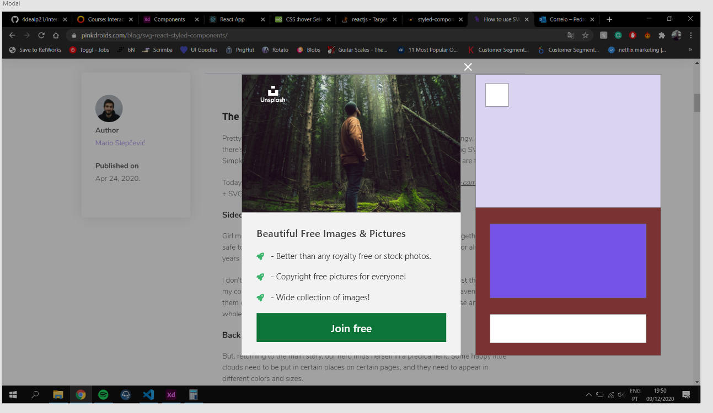

# UI Interaction Components

#### Hosted at: https://4dealp21.github.io/interaction-design/

---

## Introduction

This repository was developed to showcase five components based on the COM525 Interaction Design module's material.

It's a React-based app, and you can see each component by clicking on the links on the home page.

The whole process is documented in this Read.me file.

---

[1. Toggle Switch](#1-toggle-switch)

- [Research](#research)
- [Evaluation of guidelines](#evaluation-of-guidelines)
- [Planning and design prototyping](#planning-and-design-prototyping)
- [Coding](#coding-)
- [Screencast](#screencast)
- [Reflection](#reflection)

[2. Login Form](#2-login-form)

- [Research](#research-1)
- [Evaluation of guidelines](#evaluation-of-guidelines-1)
- [Planning and design prototyping](#planning-and-design-prototyping-1)
- [Coding](#coding)
- [Screencast](#screencast-1)
- [Reflection](#reflection-1)

[3. Button](#3-button)

- [Research](#research-2)
- [Evaluation of guidelines](#evaluation-of-guidelines-2)
- [Planning and design prototyping](#planning-and-design-prototyping-2)
- [Coding](#coding-1)
- [Screencast](#screencast-2)
- [Reflection](#reflection-2)

[4. Loading Screen](#4-loading-screen)

- [Research](#research-3)
- [Evaluation of guidelines](#evaluation-of-guidelines-3)
- [Planning and design prototyping](#planning-and-design-prototyping-3)
- [Coding](#coding-2)
- [Screencast](#screencast-3)
- [Reflection](#reflection-3)

[5. Modal](#5-modal)

- [Research](#research-4)

- [Evaluation of guidelines](#evaluation-of-guidelines-4)

- [Planning and design prototyping](#planning-and-design-prototyping-4)

- [Coding](#coding-3)

- [Screencast](#screencast-4)

- [Reflection](#reflection-4)

  

---

## 1. Toggle Switch

---

### Research

A toggle switch is similar to a on/off switch. This component is important for allowing the user to choose between two alternative states.

The switches are not new; in fact, they are seen on a regular basis, and it is not difficult to recognise some of them with which people interact.

Consider a person waking up and turning on the lights; this is the first encounter with a switch. If this person then goes on to boil some water in a kettle to make a cup of coffee, that's two interactions with switches already, and the list goes on and on for the rest of the day since there are so many items that we use that require a button to turn on/off.

Toggle switches should have an instantaneous impact and not need the user to hit a *"Save"* button to see the outcomes of his input. As [Alita Joyce](https://www.nngroup.com/articles/toggle-switch-guidelines/) , User Experience Specialist with Nielsen Norman Group, says when considering her tea kettle: *"I should not have to flip the switch off and unplug the cord to experience the change in state"*.

---

### Evaluation of guidelines

In this section it was determined which effect the toggle switch button should have.

Since the exercise was to develop a simple component, the way that the problem was seen was to show the outcome of clicking the button in the most clear way possible.

---

### Planning and design prototyping

The method discovered for presenting the interaction between the user and the component and providing rapid response was to change the colours of the interface as well as the fill of the button.

Adobe XD was the tool utilised in the design and prototyping process for this component, as well as the rest of the components in this project.

The prototype was easily done with the help of *"Component States"* feature from Adobe XD.

Here are some screenshots of the switch button in its two states:

 

---

### Coding:

---

### Screencast

---

### Reflection

The built component may be used in an application for a variety of functionality, such as filtering a search or turning settings on/off.

The animation that the background does when the switch is turned on differs from the animation that occurs when the switch is turned off, making the screen feel awkward.

---

# 2.Login Form

---

### Research

Login forms are ubiquitous, they have become a part of our daily life. Nowadays, there are a variety of login forms to be found.

This forms play a critical part in the user experience, and if they are not done properly, the user will be frustrated and will most likely abandon the application/website.

So, in order to keep the user on board, the design of these forms must be done with caution.

---

### Evaluation of guidelines

People despise login forms and try to avoid them as much as possible.

Logging in using a fingerprint on a mobile device, for example, is a great way for individuals to avoid logging in multiple times. On the desktop version, a nice option may be to include a *"Remember me"* button beside the login form, so the user may check it and not have to log in again the next time.

A good thing to add as well is a *"Forgot password"* button/link so the user can click and be redirected to a page where he will be changing his password. 

It's a good idea to include a feature that transforms the password format *"*******"* to text *"aaa"* so the user can see what password he's typing and check for misspellings. This feature is most likely to be represented with an eye icon.

Last but not least, allowing users to login via social media is a smart habit.

---

### Planning and design prototyping

The image below shows a login form on a mobile device:

---

### Coding:

---

### Screencast

---

### Reflection

Some of the aspects indicated in the *"Evaluation and Guidelines"* section, such as the *"Forgot Password"* link, *"Remember me"* button, and social network login, were not coded.

It is vital to note that the input fields are appropriately labelled, and there is a *"Not a valid email"* notice that appears when the user inserts a fictitious email, and if the user tries to login without filling out one of the input areas, a message, *"Email/Password needed"*, will appear on the screen. The user will be able to navigate more easily as a result of this.

---

# 3.Button

---

### Research

As [Will Fanguy](https://www.invisionapp.com/inside-design/comprehensive-guide-designing-ux-buttons/) says in invision blog: *"While they may go unnoticed if they’re implemented properly, buttons are a vital element in creating a positive and productive user experience."*

This is a true and vital statement.

Buttons play an important part in website and app navigation. Designers and coders frequently refer to them as CTA, which stands for *"Call to Action"*. The name says it all, these CTAs are put in various locations in order for the user to notice them and subsequently click on them.

These CTAs are crucial because they allow the user to create his or her own journey on the website/app.

---

### Evaluation of guidelines

The goal is to bring the user's attention to the button so they can click it, and there are a few principles that must be followed in order for this to happen.

It is critical to pay close attention to the size of the text inside the button. The design community has agreed that the text should take up one-third of the button's height. It will seem clear and attractive to the eyes if it is vertically aligned with the button.

Color should also draw the attention of the user. The colour of the button must not only catch the user's attention, but it must also contrast with the font colour so that the user can easily read the text or view the symbol within the button.

Last but not least, the usage of rounded corners in the design of this button was chosen since certain [studies](https://uxmovement.com/thinking/why-rounded-corners-are-easier-on-the-eyes/) claim that rounded corners improve information processing and bring our attention to the centre of the element.

---

### Planning and design prototyping

It was time to fire up Adobe XD once more and start creating to mimic all of the states that the button would have and how it would appear.

It was decided to make more than one artboard and test how many button interactions could be presented.

They are properly named as follows:

---

### Coding:

---

### Screencast

---

### Reflection

On Adobe XD, this component proved to be one of the most true to his design.

The requirements were followed, and the end outcome was exactly what was intended, as evidenced by the code.

This button on a website might attract users' attention and get them to click on it.

---

[^1] 

---

# 4.Loading Screen

---

### Research

---

### Evaluation of guidelines

---

### Planning and design prototyping

 

---

### Coding:

---

### Screencast

---

### Reflection

This component was completed quickly and simply, in keeping with his initial idea.

That was made feasible by the GIF picture created in Adobe XD using the *"GIF Maker"* plug-in.

After adding the GIF picture to the website, the only thing left to do was to add the basic text animation *"Loading"* that can be seen in the screencast above.

---

[^1] 

---

# 5.Modal

---

### Research

---

### Evaluation of guidelines

---

### Planning and design prototyping

 

---

### Coding:

---

### Screencast

---

### Reflection

---

[^1] 

---

# 
