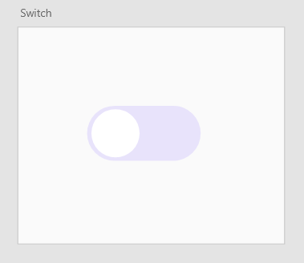

# UI Interaction Components

#### Hosted at: https://4dealp21.github.io/interaction-design/

---

## Introduction

This repository was developed to showcase five components based on the COM525 Interaction Design module's material.

It's a React-based app, and you can see each component by clicking on the links on the home page.

The whole process is documented in this Read.me file.

---

[1. Toggle Switch](#1-toggle-switch)

- [Research](#research)
- [Evaluation of guidelines](#evaluation-of-guidelines)
- [Planning and design prototyping](#planning-and-design-prototyping)
- [Coding:](#coding-)
- [Screencast](#screencast)
- [Reflection](#reflection)

[2. Login Form](#2-login-form)

- [Research](#research-1)
- [Evaluation of guidelines](#evaluation-of-guidelines-1)
- [Planning and design prototyping](#planning-and-design-prototyping-1)
- [Coding](#coding)
- [Screencast](#screencast-1)
- [Reflection](#reflection-1)

[3. Button](#3-button)

- [Research](#research-2)
- [Evaluation of guidelines](#evaluation-of-guidelines-2)
- [Planning and design prototyping](#planning-and-design-prototyping-2)
- [Coding](#coding-1)
- [Screencast](#screencast-2)
- [Reflection](#reflection-2)

[4. Loading Screen](#4-loading-screen)

- [Research](#research-3)
- [Evaluation of guidelines](#evaluation-of-guidelines-3)
- [Planning and design prototyping](#planning-and-design-prototyping-3)
- [Coding](#coding-2)
- [Screencast](#screencast-3)
- [Reflection](#reflection-3)

[5. Modal](#5-modal)

- [Research](#research-4)

- [Evaluation of guidelines](#evaluation-of-guidelines-4)

- [Planning and design prototyping](#planning-and-design-prototyping-4)

- [Coding](#coding-3)

- [Screencast](#screencast-4)

- [Reflection](#reflection-4)

  

---

## 1. Toggle Switch

---

### Research

A toggle switch is similar to a on/off switch. This component is important for allowing the user to choose between two alternative states.

The switches are not new; in fact, they are seen on a regular basis, and it is not difficult to recognise some of them with which people interact.

Consider a person waking up and turning on the lights; this is the first encounter with a switch. If this person then goes on to boil some water in a kettle to make a cup of coffee, that's two interactions with switches already, and the list goes on and on for the rest of the day since there are so many items that we use that require a button to turn on/off.

Toggle switches should have an instantaneous impact and not need the user to hit a *"Save"* button to see the outcomes of his input. As [Alita Joyce](https://www.nngroup.com/articles/toggle-switch-guidelines/) , User Experience Specialist with Nielsen Norman Group, says when considering her tea kettle: *"I should not have to flip the switch off and unplug the cord to experience the change in state"*.

---

### Evaluation of guidelines

In this section it was determined which effect the toggle switch button should have.

Since the exercise was to develop a simple component, the way that the problem was seen was to show the outcome of clicking the button in the most clear way possible.

---

### Planning and design prototyping

The method discovered for presenting the interaction between the user and the component and providing rapid response was to change the colours of the interface as well as the fill of the button.

Adobe XD was the tool utilised in the design and prototyping process for this component, as well as the rest of the components in this project.

The prototype was easily done with the help of *"Component States"* feature from Adobe XD.

Here are some screenshots of the switch button in its two states:

 

---

### Coding:

---

### Screencast

---

### Reflection

The built component may be used in an application for a variety of functionality, such as filtering a search or turning settings on/off.

The animation that the background does when the switch is turned on differs from the animation that occurs when the switch is turned off, making the screen feel awkward.

---

---

# 2.Login Form

---

### Research

---

### Evaluation of guidelines

---

### Planning and design prototyping

 

---

### Coding:

---

### Screencast

---

### Reflection

---

[^1] 

---

# 3.Button

---

### Research

---

### Evaluation of guidelines

---

### Planning and design prototyping

 

---

### Coding:

---

### Screencast

---

### Reflection

---

[^1] 

---

# 4.Loading Screen

---

### Research

---

### Evaluation of guidelines

---

### Planning and design prototyping

 

---

### Coding:

---

### Screencast

---

### Reflection

---

[^1] 

---

# 5.Modal

---

### Research

---

### Evaluation of guidelines

---

### Planning and design prototyping

 

---

### Coding:

---

### Screencast

---

### Reflection

---

[^1] 

---

# 
